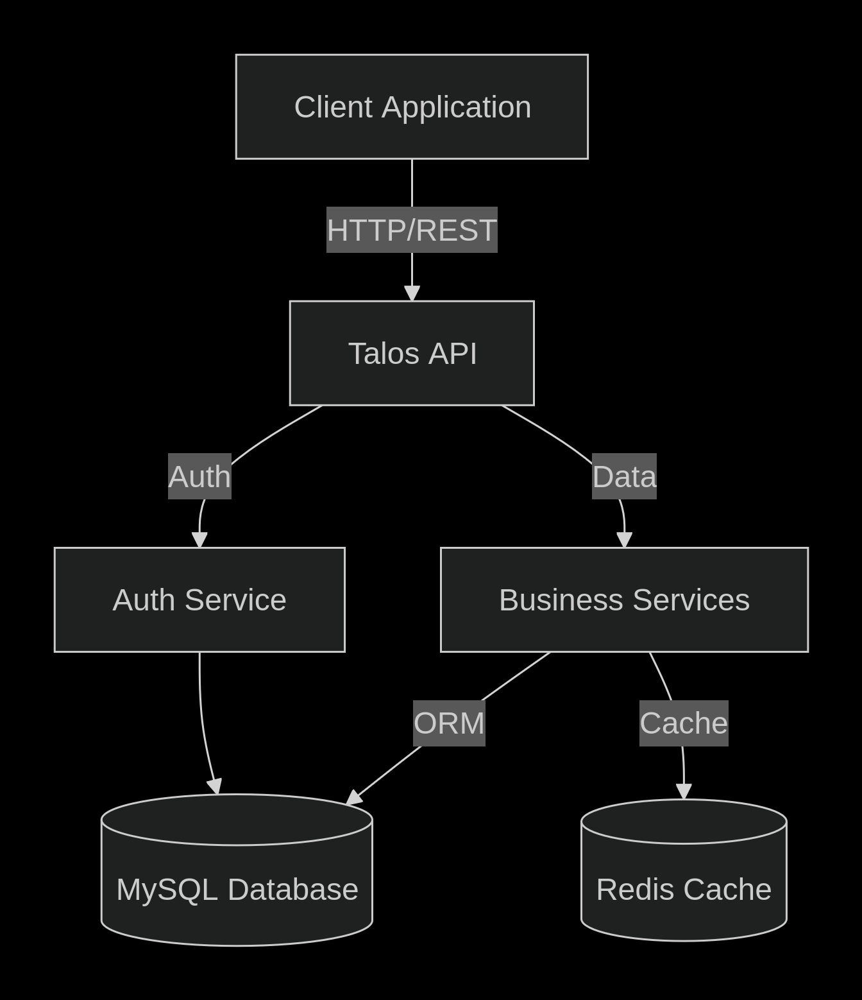
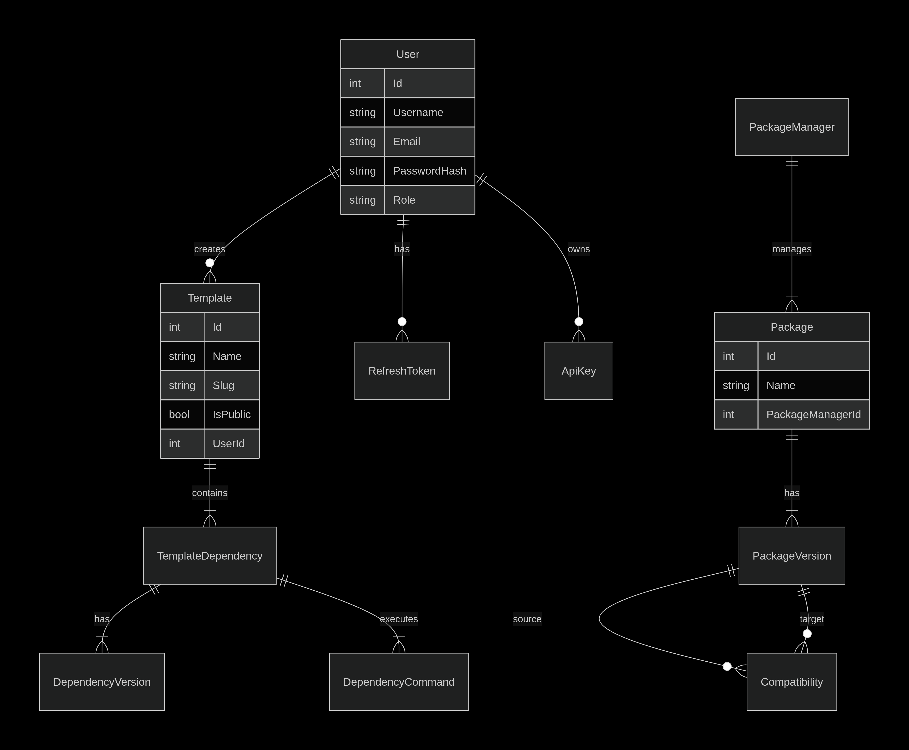
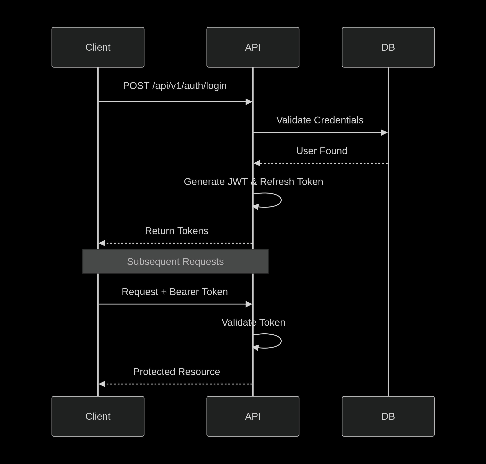

# Talos Server

Talos Server is a robust and scalable backend API for the Talos ecosystem, designed to manage packages, templates, and registries with high efficiency. Built with .NET 9.0, it provides a secure and high-performance foundation for package management operations.

## 🚀 Features

*   **Package Management**: comprehensive management of packages and versions.
*   **Template Registry**: centralized repository for project templates.
*   **Authentication & Authorization**: secure JWT-based authentication and role-based access control.
*   **API Keys**: management of API keys for programmatic access.
*   **Compatibility Checking**: automated compatibility verification for packages.
*   **High Performance**: utilizes Redis for caching and optimized database queries.
*   **Swagger Documentation**: interactive API documentation for V1 and V2 endpoints.

## 🛠️ Tech Stack

*   **Framework**: ASP.NET Core 9.0
*   **Language**: C# 12
*   **Database**: MySQL 8.0+ (Entity Framework Core 9.0)
*   **Caching**: Redis (StackExchange.Redis)
*   **ORM**: Entity Framework Core
*   **Mapping**: AutoMapper
*   **Documentation**: Swagger / OpenAPI
*   **Testing**: xUnit, Moq

## 📐 Architecture

### Project Structure

```
Talos-Server/
├── Talos.Server/                 # Main API Project
│   ├── Controllers/              # API Endpoints (V1, V2)
│   ├── Data/                     # Database Context & Seeding
│   ├── Mapping/                  # AutoMapper Profiles
│   ├── Middleware/               # Custom Middleware (e.g., ApiKey)
│   ├── Migrations/               # EF Core Migrations
│   ├── Models/                   # Data Models
│   │   ├── Dtos/                 # Data Transfer Objects
│   │   └── Entities/             # Database Entities
│   ├── Services/                 # Business Logic
│   ├── Program.cs                # App Entry Point & Config
│   └── appsettings.json          # Configuration Settings
├── Talos.Server.Tests/           # Unit & Integration Tests
│   ├── Common/                   # Shared Test Utilities
│   ├── Controllers/              # Controller Tests
│   ├── Helpers/                  # Test Helpers
│   └── Services/                 # Service Tests
├── Talos.Database/               # Database Scripts/Docker
├── compose.yaml                  # Docker Compose Config
└── README.md                     # Project Documentation
```

### System Architecture



### Database Schema




### Authentication Flow



## 🔌 API Endpoints

### V1 Endpoints

#### Authentication (`/api/v1/auth`)

| Method | Endpoint | Description | Access |
| :--- | :--- | :--- | :--- |
| POST | `/login` | Authenticate user and get tokens | Public |
| POST | `/register` | Register a new user | Public |
| POST | `/refresh` | Refresh access token | Authenticated |
| POST | `/logout` | Revoke refresh token | Authenticated |
| GET | `/profile` | Get current user profile | Authenticated |
| PUT | `/profile` | Update user profile | Authenticated |

#### Templates (`/api/v1/templates`)

| Method | Endpoint | Description | Access |
| :--- | :--- | :--- | :--- |
| GET | `/` | Get all public templates (paginated) | Public |
| GET | `/{id}` | Get template details | Authenticated |
| POST | `/` | Create a new template | Authenticated |
| PUT | `/{id}` | Update a template | Authenticated |
| DELETE | `/{id}` | Delete a template | Authenticated |

#### Packages (`/api/v1/packages`)

| Method | Endpoint | Description | Access |
| :--- | :--- | :--- | :--- |
| GET | `/` | List all packages | Public |
| GET | `/{id}` | Get package details | Public |
| POST | `/` | Create a package | Authenticated |

#### Package Managers (`/api/v1/package-managers`)

| Method | Endpoint | Description | Access |
| :--- | :--- | :--- | :--- |
| GET | `/` | List supported package managers | Public |
| GET | `/{id}` | Get manager details | Public |

#### Registry (`/api/v1/r`)

| Method | Endpoint | Description | Access |
| :--- | :--- | :--- | :--- |
| GET | `/{userId}/{slug}.json` | Retrieve template configuration for CLI | Public |

#### Compatibility (`/api/v1/compatibility`)

| Method | Endpoint | Description | Access |
| :--- | :--- | :--- | :--- |
| GET | `/check` | Check compatibility between packages | Public |

#### Users (`/api/v1/users`)

| Method | Endpoint | Description | Access |
| :--- | :--- | :--- | :--- |
| GET | `/` | List users | Admin |
| GET | `/{id}` | Get user details | Authenticated |

#### Install (`/api/v1/install`)

| Method | Endpoint | Description | Access |
| :--- | :--- | :--- | :--- |
| GET | `/script` | Get installation script | Public |

#### Cache Test (`/api/v1/cache-test`)

| Method | Endpoint | Description | Access |
| :--- | :--- | :--- | :--- |
| GET | `/` | Test Redis cache connection | Public |

### V2 Endpoints

#### API Keys (`/api/v1/admin/apikeys`)

| Method | Endpoint | Description | Access |
| :--- | :--- | :--- | :--- |
| GET | `/` | List all API keys | Admin |
| POST | `/create` | Generate a new API key | Admin |
| POST | `/revoke/{id}` | Revoke an API key | Admin |

#### Community (`/api/v2/community`)

| Method | Endpoint | Description | Access |
| :--- | :--- | :--- | :--- |
| - | - | *Coming Soon* | - |

#### Tags (`/api/v2/tags`)

| Method | Endpoint | Description | Access |
| :--- | :--- | :--- | :--- |
| - | - | *Coming Soon* | - |

## 📋 Prerequisites

*   [.NET 9.0 SDK](https://dotnet.microsoft.com/download/dotnet/9.0)
*   [Docker](https://www.docker.com/) (optional, for containerized deployment)
*   [MySQL](https://www.mysql.com/) (local or containerized)
*   [Redis](https://redis.io/) (optional, falls back to memory cache)

## ⚡ Getting Started

### 1. Clone the Repository

```bash
git clone https://github.com/yourusername/talos-server.git
cd talos-server
```

### 2. Configuration

Update `appsettings.json` with your database connection string and JWT settings:

```json
{
  "ConnectionStrings": {
    "DefaultConnection": "Server=localhost;Database=Talos;User=root;Password=yourpassword;"
  },
  "JwtSettings": {
    "Key": "your-super-secret-key-minimum-32-chars",
    "Issuer": "TalosServer",
    "Audience": "TalosClient"
  }
}
```

### 3. Database Migration

Apply the database migrations to create the schema:

```bash
cd Talos.Server
dotnet ef database update
```

### 4. Run the Application

```bash
dotnet run
```

The API will be available at `http://localhost:5000` (or the configured port).

### Docker Support

You can also run the application using Docker Compose:

```bash
docker-compose up -d
```

## 🧪 Testing

The project uses xUnit for unit and integration testing. To run the tests:

```bash
dotnet test
```

To generate a coverage report:

```bash
dotnet test --collect:"XPlat Code Coverage"
```

## 📚 API Documentation

Once the application is running, you can access the interactive Swagger documentation at:

*   **V1**: `/swagger/index.html?urls.primaryName=Talos%20API%20v1`
*   **V2**: `/swagger/index.html?urls.primaryName=Talos%20API%20v2`

## 🤝 Contributing

Contributions are welcome! Please feel free to submit a Pull Request.

